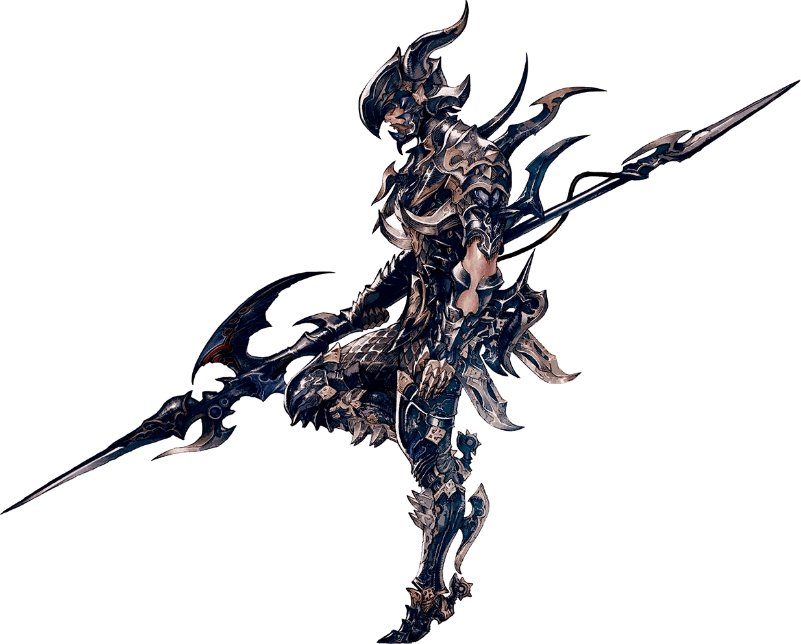

#  <!--Dragoon.jl-->

# Dragoon

[](undefined)
[](undefined)

## Installation
To install package run
```julia
julia> ]add https://github.com/bergermann/Dragoon.jl.git
```
and add dependencies
```julia
julia> ]add https://github.com/mppmu/BoostFractor.jl.git
julia> ]add Plots
```

## Usage
Look at [examples](./examples) for comprehensive guides.
